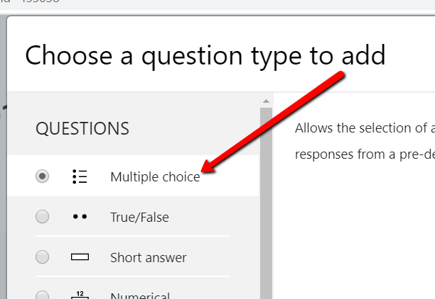
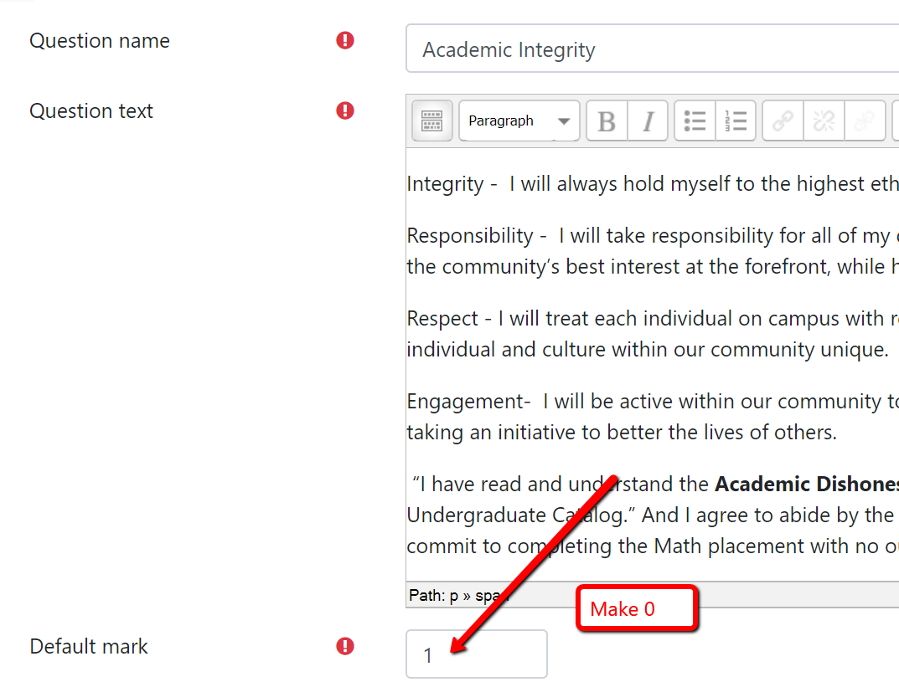
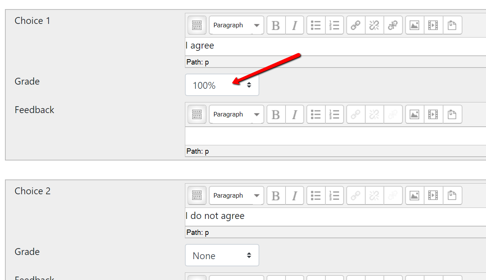
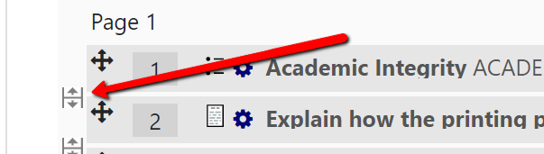
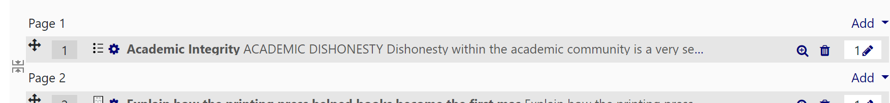
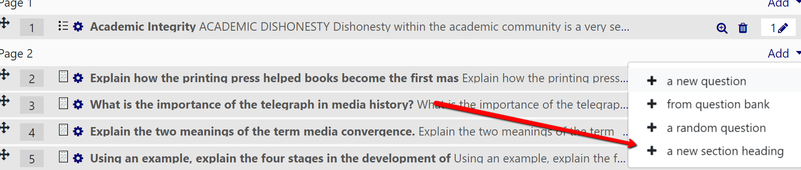
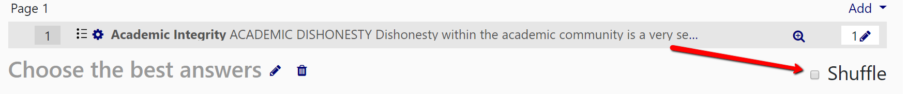
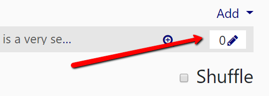

# Add the Academic Integrity Statement to a Moodle Quiz

Click on the quiz name then click on the gear upper right. Edit Quiz. Add a new question – pick multiple choice

Copy and paste the statement (provided below) in the _Question text_ and name the question _Academic Integrity_. be sure to change the default mark to 0 so the question does not affect the quiz score.

Scroll down the page and input response choices.

Scroll to the bottom of the page and Save Changes. Once back in the quiz, move the question to the top of the list and create a page break after the question.

After the question click on Add and add a _New section heading_.

This new section heading (you can name it whatever you want) now allows you to shuffle questions below the Academic Integrity question and it will be not shuffled in the mix. It will stay at the top of the page.

Be sure to change the point value to 0 by clicking on the pencil icon, adding 0 and hitting enter.

---

## Academic Dishonesty

Dishonesty within the academic community is a very serious matter, because dishonesty destroys the basic trust necessary for a healthy educational environment. Academic  dishonesty is any treatment or representation of work as if one were fully responsible for it, when it is in fact the work of another person.

Academic dishonesty includes cheating, plagiarism, theft, or improper manipulation of laboratory or research data or theft of services. Plagiarism occurs when a writer deliberately uses someone else&#39;s language, ideas, or other original (not common-knowledge) material without properly acknowledging its source (Marietta College Catalog, 2019-2020).

### THE PIONEER PLEDGE

The Marietta College Pioneer Pledge provides the philosophical foundation upon which the Code of Conduct, as described throughout this handbook, is based.

Honesty -  I will always communicate truthfully with all members of the Marietta College community.

Integrity -  I will always hold myself to the highest ethical principles both personally and academically.

Responsibility -  I will take responsibility for all of my decisions, and will challenge others to make decisions that put the community&#39;s best interest at the forefront, while holding them accountable  for the decisions that they make.

Respect - I will treat each individual on campus with respect and learn to appreciate the differences that make each individual and culture within our community unique.

Engagement-  I will be active within our community to make a positive difference, and to help serve those who are taking an initiative to better the lives of others.

I have read and understand the  **Academic Dishonesty Policy** of Marietta College as defined in the Undergraduate Catalog and I agree to abide by the Pioneer Pledge from the Student Handbook. As such, I commit to completing this exam with no outside assistance either by person or technology.
