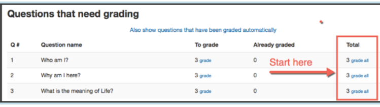
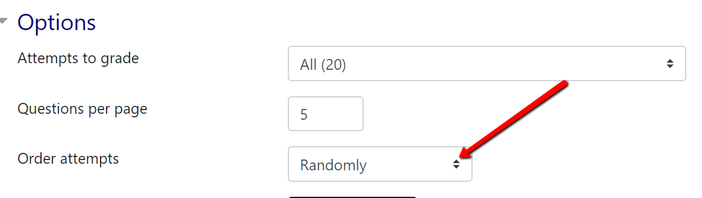
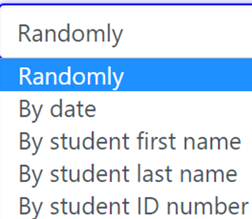
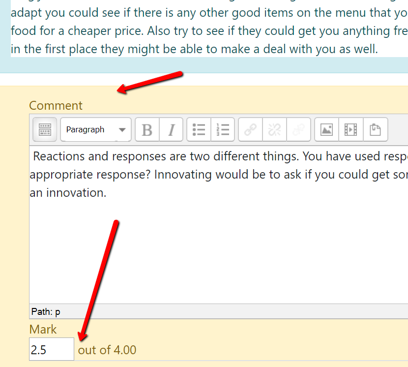

# **Grading Moodle Quiz Questions Manually**

Click on the quiz that you would like to grade.

Click on the gear on the upper right hand side.

Choose **Manual grading**.

Click on **Grade all**

Choose how you want to grade by using the dropdown

Look at the student entry, make comments, provide a mark. Items are saved automatically and can be edited anytime.

