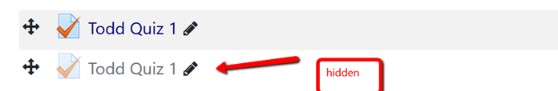

<!-- todo: add note about when this changed occurred? -->
# Activity Change in Moodle 

Currently, resources hidden from students in your Moodle instance have a note associated with them that reminds you that the resource is hidden from students. Students have no idea the resource is even there. They do not see the resource or the note. 

That has not been the case for activities like assignments or quizzes. If the activity hidden from the student, they could still see it with the note that it was not available to students. The activity was not clickable, but they were aware it was there. This has been changed in Moodle. Now, if you hide an assignment or exam in Moodle from students there is no note reminding you it has been hidden but rather the link is grayed out. In doing this, the student has no idea the activity is even in the course. 

