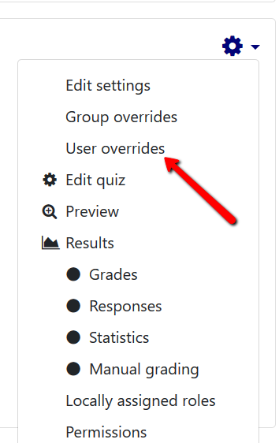
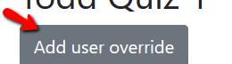
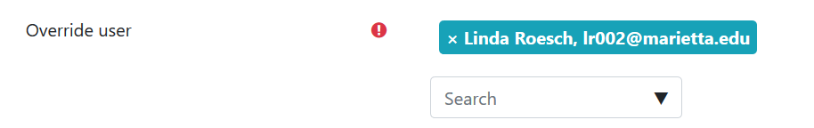
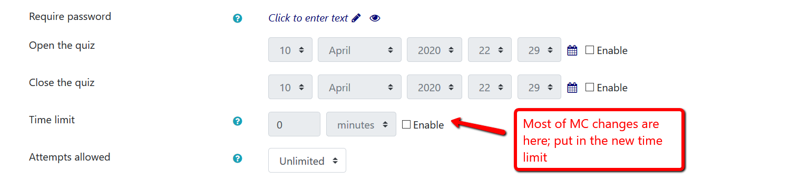
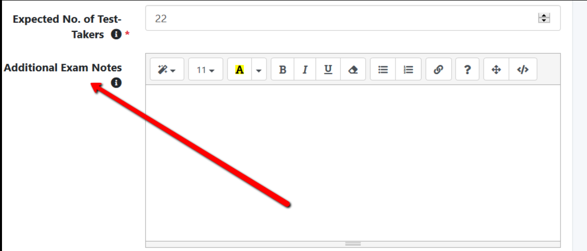

# Providing Time Accommodations in Moodle/ProctorU

**If a student is to be afforded time accommodations, this must be set up in advance in Moodle, and if you are using ProctorU, it needs to be noted in your exam request.**

You can easily reset a quiz or assignment for an individual using Moodle's User Override function. This function can be helpful when working with students requiring special accommodations.

The function allows you to:

- Extend the time limit for a quiz or assignment
- Change the dates and time a quiz or assignment is available
- Add more attempts for a quiz
- Add a password to the quiz
- Set a time limit for the quiz

You can set different individual User Overrides or copy and use the same override settings for multiple people. If using the group override option, you must first make the group(s).

Override settings apply only to the student(s) or group(s) you select.

Click on the quiz for which you must provide student accommodations

Click on the gear on the upper right hand side

Choose option, _User overrides_

Click _Add user override_

Search for or select a student name; make sure the name shows up in blue above the search box – this way you know the student has been selected; you can only work on one student at a time

Define the override restrictions as needed. _The settings visible in the Override section are the original settings for all members of the class. (See image below.)_

You may:

- Add a password (optional but a good practice.)
- **Enable** and choose new **Open the quiz** and **Close the quiz** dates and times.
- **Enable** and change the **Time limit (most common)**
- Change the number of **Attempts allowed**.

**Warning:** Make sure your student's increased time limit is not overridden by the _Close the quiz_ time. You may have to extend this to accommodate the extra time! Generally, for these students you may want to consider NOT enabling a _Close the quiz_ time – let the Moodle _Time limit_ govern this for you. Using the _Time limit_ as opposed to the _Close the quiz_ option to control quiz timing is preferable because with the _Time limit_, students see a countdown clock. If you do not use a _Time limit_, and just have the quiz close at an exact time, there is no countdown clock for the student.

If a student gets extra time on a quiz proctored by ProctorU, this must be noted in the ProctorU test request form under _Additional Exam Notes_ – put the student's name, the accommodation and a note that you have remembered to allow for extra time in Moodle. For example: "Linda Roesch has time and a half on the exam; the correct timing has been added to Moodle"

