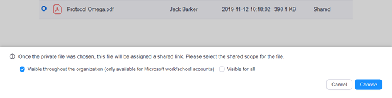

# **Using the OneDrive Integration with Zoom**

**Overview**

The OneDrive integration allows you to share OneDrive files in Zoom. After connecting your Zoom account, you can easily share OneDrive files in chat and during meetings.

**Prerequisites**

- Zoom desktop client for Windows or Mac
- Microsoft OneDrive Integration enabled by the admin
- Microsoft account (personal, work, or school)
- **Note** : For the Zoom mobile app, you [can send files from OneDrive](https://support.zoom.us/hc/en-us/articles/202920879) using the built-in feature. An admin does not need to enable this feature on the mobile app.

**Enabling OneDrive Integration (Admin)**

1. Sign into the Zoom web portal.
2. Click  **Advanced**  &gt;  **Integration**.
3. Click the  **Microsoft OneDrive**  toggle to enable OneDrive integration.

**Sharing OneDrive Files in Chat**

You can share your OneDrive files in chat or in-meeting chat. Shared files are not directly uploaded to Zoom chat. Instead, this will create a shareable link for the file and post it in chat. Contacts in the chat can click the file to open a browser and view the file in OneDrive.

1. Sign in to Zoom desktop client.
2. Access chat or in-meeting chat:
  - **Chat**: Click the  **Chat**  tab.
  - [**In-meeting chat**](https://support.zoom.us/hc/en-us/articles/203650445): Start or join a meeting, then click  **Chat**  in the [meeting controls](https://support.zoom.us/hc/en-us/articles/360021921032).
3. Click  **File**  &gt;  **OneDrive**.
4. Click  **Connect**. If prompted, sign into your Microsoft account and authorize Zoom to access your OneDrive.
 You will see a web page with your OneDrive files.

 

5. Select the file you want to share.

 

6. In the bottom panel select one of these options:
  - **Visible throughout the organization (only available for Microsoft work/school accounts)**: Only members in your organization can click the link to view or download the file.
  - **Visible for all** : Anyone with the link can view or download the file.
7. Click  **Choose**.
8. When prompted by your browser, click  **Open Zoom Meetings**.
 Zoom will post a link to the OneDrive file. Contacts in the chat can click the link to open a browser and view the file in OneDrive.

 

**Presenting OneDrive Files while in a Meeting**

You can present OneDrive files while in a Zoom meeting. Zoom will open the OneDrive file and start a screen share.

1. Sign into the Zoom desktop client.
2. Start or join a meeting.
3. Click  **Share**  in the [meeting controls](https://support.zoom.us/hc/en-us/articles/360021921032).
4. Click the  **Files**  tab, select  **Microsoft OneDrive** , and click  **Share**.
5. Click  **Connect**. If prompted, sign into your Microsoft account and authorize Zoom to access your OneDrive.
 You will see a web page with your OneDrive files.

 

6. Select the file you want to share.

 

7. In the bottom panel. select one of these options:

  - **Visible throughout the organization (only available for Microsoft work/school accounts)**: Only members in your organization can click the link to view or download the file.
  - **Visible for all** : Anyone with the link can view or download the file.
8. Click  **Share screen**.
9. When prompted by your browser, click  **Open Zoom Meetings**.
 Zoom will open the OneDrive file in your browser and start sharing your screen.
10. Click  **Resume Share**  if your screen share is paused.
