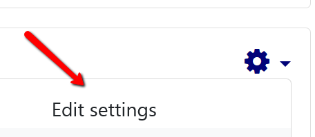
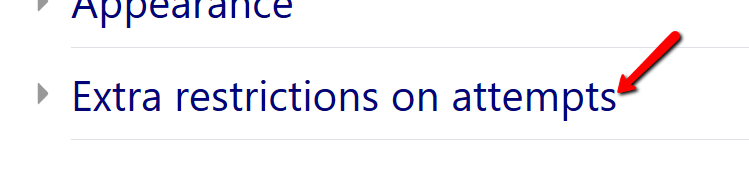

# Password Protecting Your Moodle Quiz

It is sometimes advantageous to password protect your quizzes. This is particularly important when using a proctoring service like ProctorU.

- Only ProctorU has the password. They will input it into the quiz as part of the proctoring process. In this instance, the password should not be given to the student. This ensures that the student takes the assessment under the supervision of a proctor and not on their own.
- Instructors can require students to enter a password to take a quiz. This is helpful if a quiz is assigned to a group of students, instead of the whole class. The student will have to enter the password before they begin on their own.

The Moodle password feature is found when editing the settings on a quiz, under the section called _Extra Restrictions on Attempts_.

Click on the quiz that you would like to password protect.

Click on the GEAR on the upper right hand side

Choose the first option, _Edit settings_.

Scroll down the page and look for _Extra restrictions on attempts_.

Add your password. You will have to place this password in your proctoring request for ProctorU.

