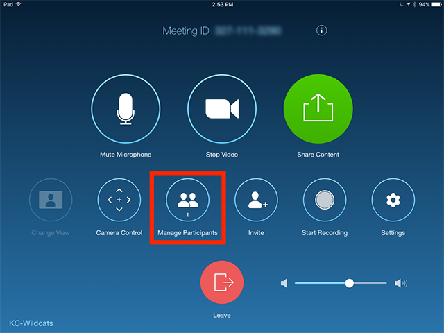
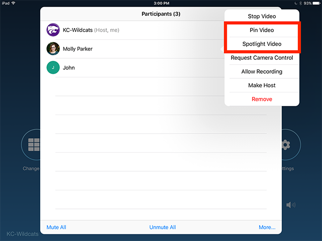
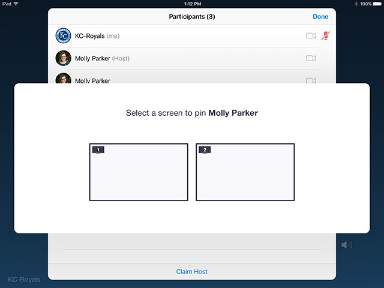

# Pin or Spotlight Video

## Overview

You can [**pin**](https://support.zoom.us/hc/en-us/articles/201362743) or [**spotlight**](https://support.zoom.us/hc/en-us/articles/201362653) a video during a meeting.

Pin screen allows you to disable active speaker view and only view a specific speaker. Pinning another user&#39;s video will only affect your local view in the Zoom Room, not the view of other participants and will not affect cloud recordings.

Spotlight video puts a user as the primary active speaker for all participants in the meeting and cloud recordings. To spotlight, you need at least 3 participants in the meeting with their video on and can only be done by the host.

## Prerequisites

- Zoom Rooms for Mac Version: 4.0x and higher
- Zoom Rooms for PC Version: 4.0x and higher
- Zoom Rooms iPad Controller Version: 4.0x and higher
- Zoom Rooms Android Controller Version 1.0.47361.0908 or higher

## Instructions

1. Start a new or scheduled meeting.
2. Tap  **Manage Participants**  on the Zoom Room Controller.
 
3. Tap the Host or Participant&#39;s name \&gt; tap  **Pin**  or  **Spotlight Video.**
 
4. If you have multiple screens in your Zoom Room, you can choose which screen to pin the video to.
 
