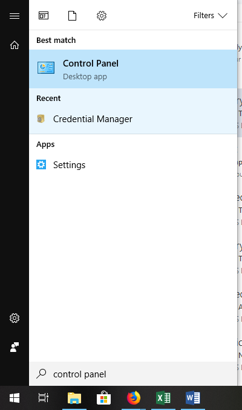
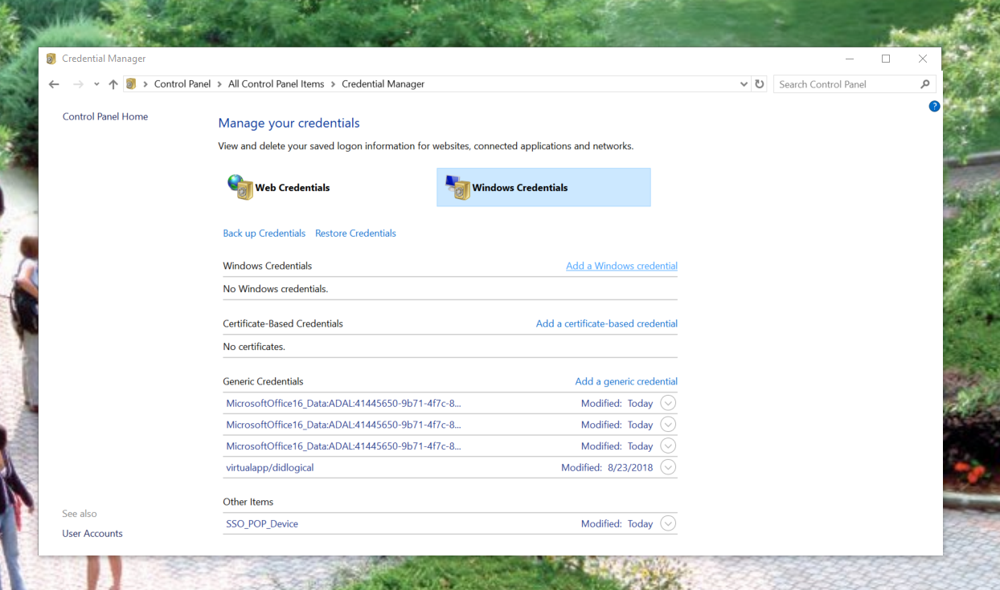
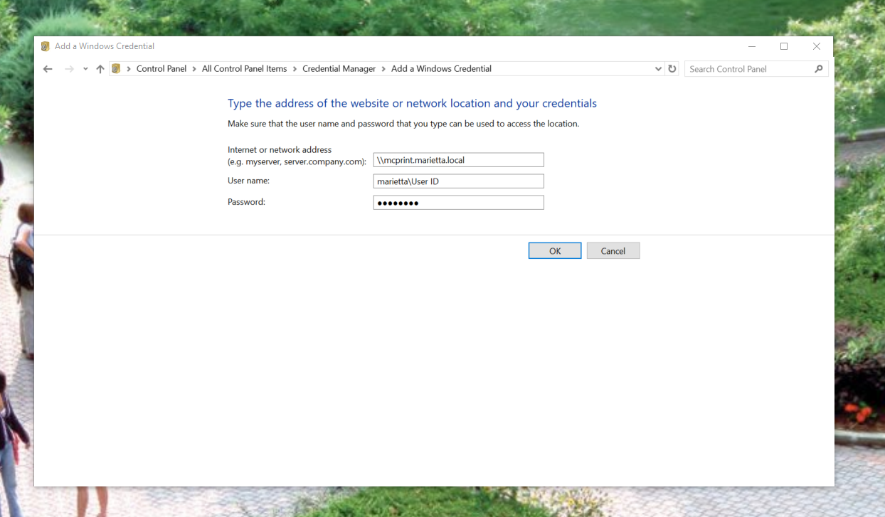
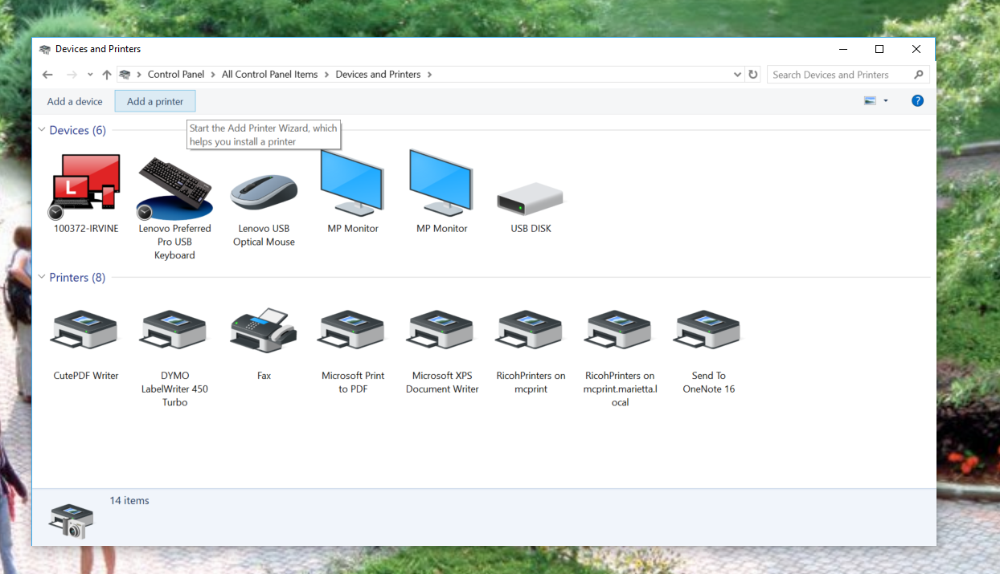

# How to add Ricoh Printers through Windows Credential Manager

1. Open Control Panel by opening the Windows menu and typing &quot;Control Panel&quot; to search
 

2. Click on the <b>Credential Manager</b>
 

3. Click on <b>Windows Credentials</b> and then <b>Add a Windows credential</b>
 

4. The network address is <kbd>mcprint.marietta.local</kbd>, the username is <kbd>marietta\User ID</kbd> (Replace User ID with your Marietta College credentials), and the password is your MyMarietta password.
 

5. Go back to Devices and Printers and select <b>Add a printer</b>;
 

6. Click <b>The printer that I want isn&#39;t listed</b> and then <b>Select a shared printer by name</b>. Type <kbd>\\mcprint.marietta.local\ricohprinters</kbd> into the text box.
 

7. Click through the message boxes that pop up after your computer downloads the driver automatically.
